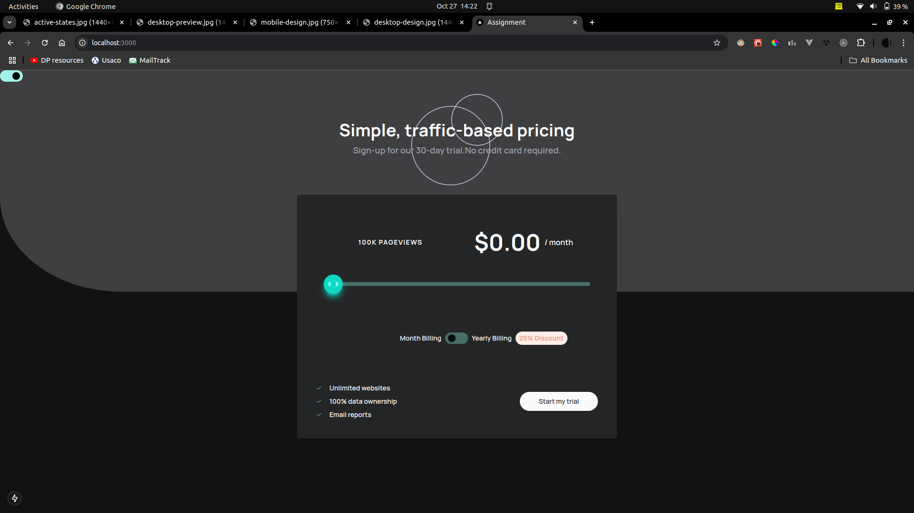
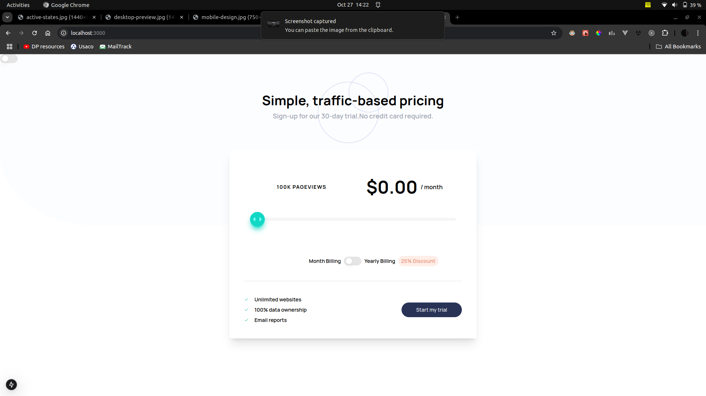
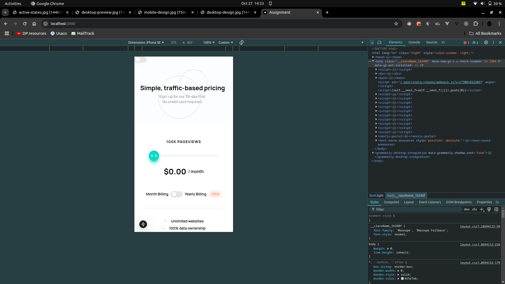
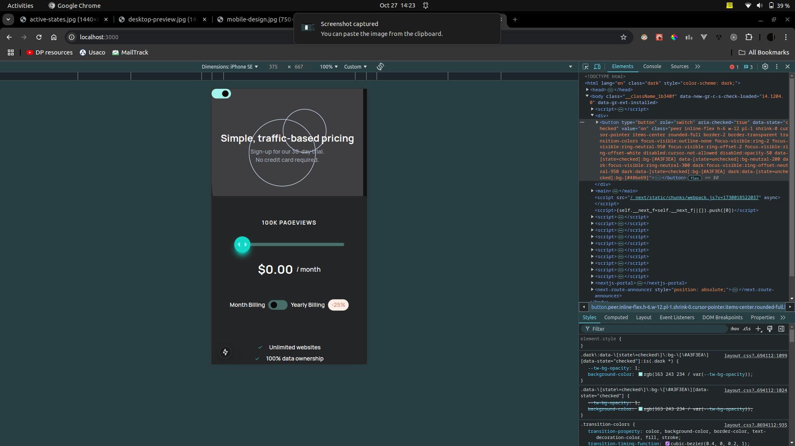
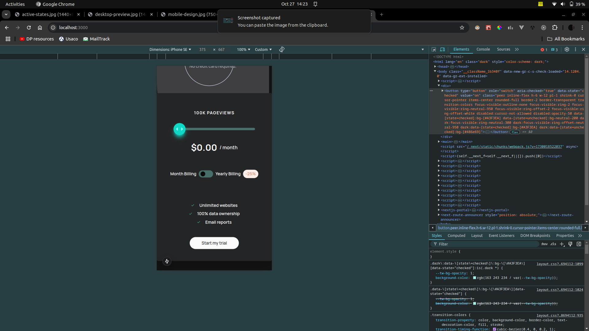

# Assignment

Getting Started

First, run the development server:
```bash
pnpm dev
```

Open [http://localhost:3000](http://localhost:3000) with your browser to see the result.


## Screenshots






